## Docsify setup with podman  ##

**Requirement of docsify setup:**

Docsify is a lightweight, flexible, and easy-to-set-up documentation generator that can turn your Markdown documentation into a website.

- Distributor ID: Ubuntu <br>
- Description: Ubuntu 20.04.6 LTS <br>
- Release: 20.04 <br>
- Codename: focal<br>

## Requirement Tools
 
 - Podman 

## Podman

- Podman is a tool that helps you run and manage software packages called containers on your computer.
 
<br>  
Now start a setup by following these steps:
<br>

## Step 1: Update Your System

First update and upgrade by using this command :
```bash
sudo apt update 
```
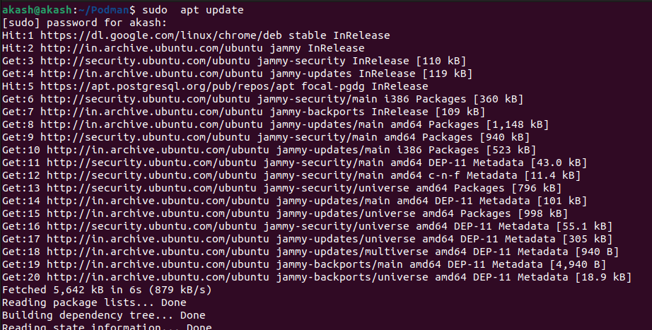

```bash
sudo apt upgrade
  ```

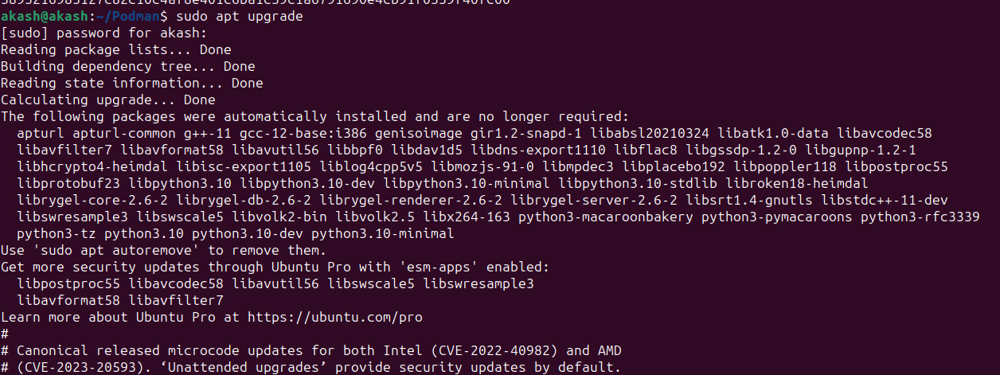

Then use podman installation command:


## Step 2: Install Podman

```bash
sudo apt  install -y podman
```

- podman : It is the name of the package you want to install.

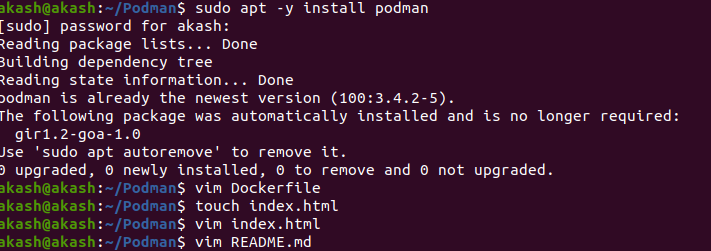
## Step 3: Check Podman Version

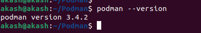

## Step 4: Create a Directory

```bash
mkdir Podman
```

- mkdir : This command use for making a new directory
- docs : Name of new directory.

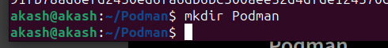

## Step-5:- Create Dockerfile

Add details in Dockerfile:

```bash
sudo apt install vim

```
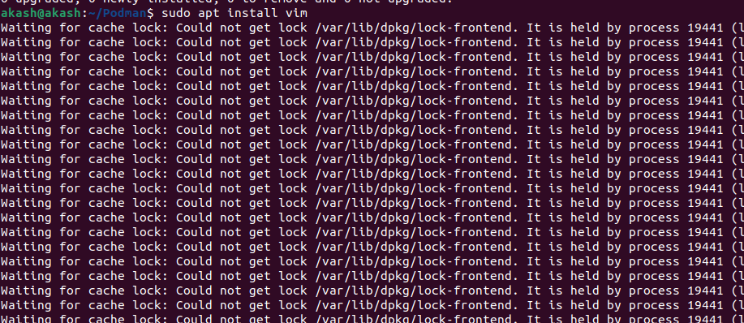

```bash
vim Dockerfile
```


- vim : Use for create and edit a file.

- Dockerfile : Name of file.

Add details in Dockerfile:

please insert button and than

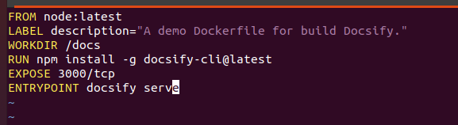

save this file
1) Press:- esc
2) Type:- :wq
3) Press:- Enter button

## Step-6:-Create index.html


please insert button and than


``` bash 
vim index.html
```

save this file
1) Press:- esc
2) Type:- :wq
3) Press:- Enter button


Add details in html file:

## Step-7:- Create new file in md format

```  bash
touch README.md
```

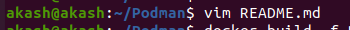

- touch : Use for creating new file.
  
Here we can check all files by using this command:

- ls : It is a Linux shell command that lists directory contents of files and directories.


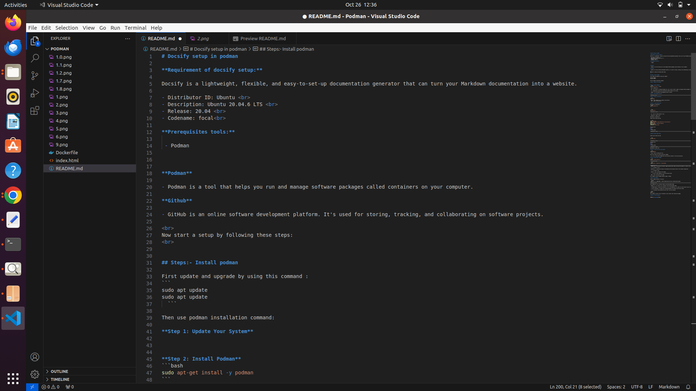
## Step-8:- Build docker image

```bash
sudo apt  install docker.io
```
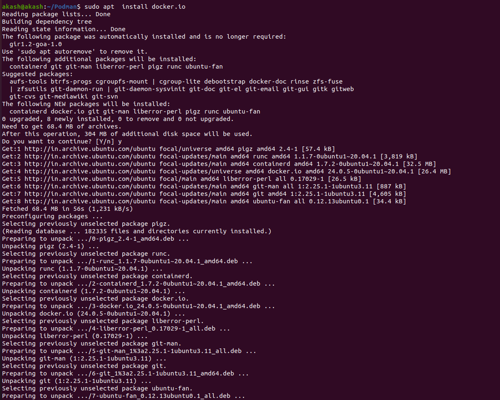

```bash
 podman build -f Dockerfile -t docsify/demo .
 ```

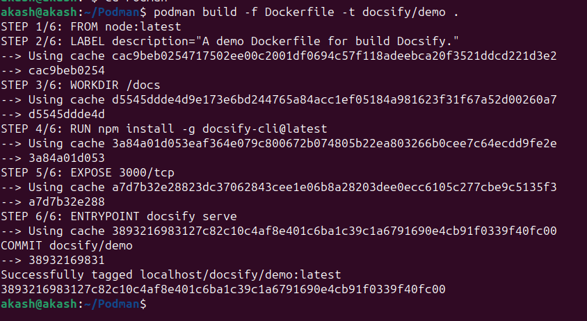

This command is used to manage container images in Podman.

## Step-9:-Run podman

Create a podman container for docsify.

```bash
 podman run -itp 3000:3000 --name=podman -v /home/akash/podman:/docs localhost/docsify/demo
```

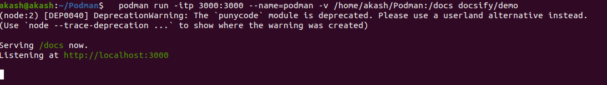

This command is used to see all containers on your system, both running and stopped.


``` bash 
podman ps -a
```
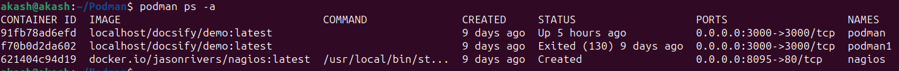

```bash  
podman ps
```
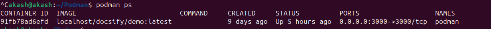


## Step-10:- Fill Output

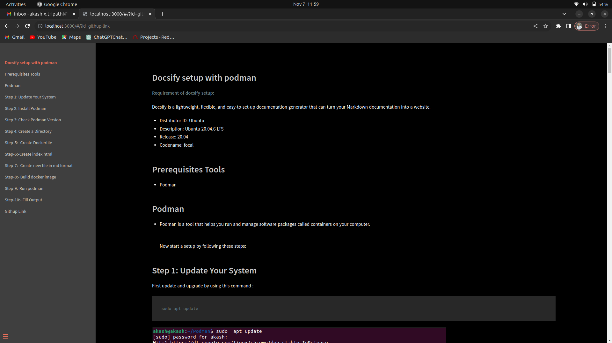


##  Githup Link 


https://github.com/akash9458/Docsify-setup.git
